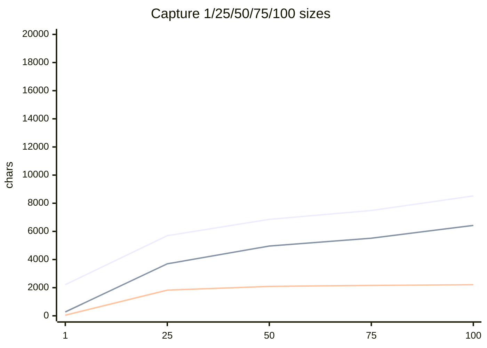

# LUME 100-CAPTURE LONG-HAUL REPORT

**Do not merge. Evaluation only. Production behaviour was not changed.**

**LIVE RUN BLOCKED — CREDENTIALS REQUIRED.** `OPENAI_API_KEY` was unset in this environment. Deterministic artefacts are **not** live extract/Ask proof.

---

## 1. Executive verdict

**RED**

| Axis | Verdict | Why |
| --- | --- | --- |
| Truth longevity | **RED** | Create-todo/risk/milestone titles are the **full Capture transcript**. Current KC is archaeological prose, not a bounded project. Sarah Kim never landed. Vendor-delay never became its own risk. |
| UI longevity | **AMBER** | Pages load, no hydration failure, no horizontal overflow. To Do / Important dates / Current position become enormous duplicate blobs by Capture 50–100. |
| Capture cost growth | **AMBER** | Extract prompt 2.2k → 8.5k chars (3.8×), tiktoken **492 → 2626** (5.3×). Authoritative projectBlock 275 → 6425 (23×) while counted objects 3 → 37. Growth is fat titles + completed records in the current block, **not** History leaking into the V2 extract prompt. |
| Ask cost growth | **AMBER** | Current-state Ask context 0.95k → 6.7k (~7×), tiktoken 288 → 2224. Historical Ask 8.5k / 2833 tokens. Canonical MODE:current omits History (good). C50→C100 current Ask **fell** (7101 → 6717) while History 46 → 81 — current-state Ask does **not** track History. |
| Model/extraction longevity | **RED** *(not live-proven)* | Live extract/Ask did not run. Hostile analyse-only restatements (**TEST-PROVEN**, never Applied): person reaffirm stays `no_change`; restating Release / resolved CAB **would write** because short names cannot match transcript-shaped labels. |
| Persistence/reload | **GREEN** | 100/100 completed. Reload matched. No wrong-project write. Needs-you wrote 0. History after writes; none on needs-you. |

---

## 2. Run environment

| | |
| --- | --- |
| main SHA | `09d85c07dec44a7a68be02cb98e0deffd96a4c1a` |
| harness branch | `cursor/v1-longhaul-100-610b` (pack HEAD is the commit that lands this report) |
| artefact `harnessSha` at generation | `09d85c07…` (parent of the harness commit) |
| model | `deterministic-oracle-envelope` (live model unused) |
| live or deterministic | **Deterministic Apply/persist.** Live extract **blocked**. |
| database | `FakeWorkspaceClient` (isolated in-process). Not customer data. |
| captures attempted / completed | 100 / 100 |
| Ask calls | 30 context assemblies (5 probes × 6 checkpoints). **No live Ask HTTP.** |
| Analyse-only probes | 12 checkpoint restatements (never Applied). |
| total AI calls | **0** |
| elapsed | 666 ms deterministic Apply + tiktoken loop; Playwright UI 12.1s |

Proof labels:

- Persistence / Apply / History / reload / analyse-only resolve — **TEST-PROVEN**
- Extract prompt size vs truth vs History — **CODE-PROVEN** (`buildObservationExtractionPrompt` + `formatAuthoritativeStateForPrompt` + `buildCaptureContext` + `buildTellMeContext`)
- Token estimates — **CODE-PROVEN** js-tiktoken `cl100k_base` (`estimateTokens`). API `prompt_tokens` were **null**.
- Extract/Ask **quality** — **not live-proven**
- Token API usage — **not live-proven**

Command:

```bash
npm run stress:project-longhaul -- --captures=100
npm run stress:project-longhaul -- --captures=100 --mode=live
# live: LIVE RUN BLOCKED — CREDENTIALS REQUIRED (exit 2)
npx playwright test e2e/longhaul-ui.spec.ts
```

---

## 3. Project at Capture 100

Northstar Member Portal Renewal is in **hypercare after a 27 October go-live**, with a usable people list and a **not-usable** action/date board.

**People (11 landed, all role=Stakeholder):** Priya Shah, Liam Brooks, Sarah Okonkwo, Marcus Chen, Elena Voss, Jordan Hale, Dev Patel, Amira Rahman, Tomiko Sato (still listed after “left”), Chris Bell, Nadia Qureshi. **Sarah Kim never created.**

**Dates:** three timeline rows, **identical full-transcript labels**, dates 18 Oct / 18 Oct / 27 Oct. UAT did move from 14 → 18. CAB stayed 18th. Release stayed 27th.

**Open work (titles are capture dumps):** session timeout; vendor contract check; feature-flag cleanup; hypercare rota; seed todo “Confirm project baseline…”; a leftover CSV-export dump still open.

**Risks:** one open blob that *contains* both API timeout and vendor-delay wording (vendor-delay never got its own row); legacy session **accepted**; CAB rejection **resolved**.

**Decisions that did stick in Current position / Decisions:** feature-flag cutover; SSO in / marketing widgets out; flags 48h; go-live 27 Oct; live/hypercare.

This does **not** yet read as “the project we spent 100 updates building.” It reads as a chat log pasted into To Do and Important dates.

---

## 4. Truth integrity

| | |
| --- | --- |
| First divergence | Capture **9** — todo title is the transcript, not “Login error handling” |
| Total divergences | 92 / 100 captures (mostly repeating title mismatches) |
| Title diffs (repeated) | same P0, counted once per object per capture |
| Missing-object diffs | Sarah Kim; distinct vendor-delay risk; some stacked siblings |
| Reload mismatches | 0 |
| Wrong-project writes | 0 (`stoppedAt` null). Atlas still has Quinn Adler + open “Close the billing ledger”. |
| Duplicate person names | 0 |
| Duplicate todo **titles** | yes (capture 21 perf + SSO share one transcript title) |
| Duplicate milestone **labels** | yes (3 identical labels) |

**Recovered:** todo/risk/milestone **IDs** stayed stable; completes/dates applied on those IDs despite garbage titles. Identity map has ~40 keys.

**Unresolved:** transcript-as-title; stacked person/risk create drops siblings; Sarah Kim missing; vendor-delay missing as its own risk; roles not written (always Stakeholder); Tomiko still a stakeholder after leave (no leave primitive — recorded, not a harness repair).

Needs-you captures **42, 50, 51**: `applied=0`. **PASS** for Review integrity.

Later Captures **did** complete/move objects created earlier. They did **not** repair titles or resurrect missing siblings.

---

## 5. Truth checkpoint table

| After | People expected/actual | Open todos (oracle / board rows) | Open risks (oracle / rows) | Milestones | History events | Reload | Notes |
| ---: | --- | --- | --- | ---: | ---: | --- | --- |
| 1 | 1 / 1 Priya | 0 / 1 seed | 0 / 0 | 0 | 3 | OK | Clean KC |
| 10 | 8 / 8 | 2 / 3 | 0 / 0 | 0 | 14 | OK | Dates/risks not yet |
| 25 | 10 / 10 | 11 / 12 | 3 / 2 | 3 identical labels | 33 | OK | Cards growing; vendor-delay missing |
| 50 | 11 / 10 | 13 / 17 | 3 / 2 | 3 | 46 | OK | No Sarah Kim; duplicate todo title |
| 75 | 11 / 10 | 12 / 20 | 3 / 3 | 3 | 62 | OK | Completes lag titles so “open” counts diverge |
| 100 | 12 / 11 (no Sarah Kim) | 5 / 24 rows (many done with dump titles) | 1 / 3 rows (2 not open) | 3 same label | **81** project / 82 table | OK | Live/hypercare in Current position |

EXPECTED vs ACTUAL on **identity and done/status** is much healthier than on **display titles**. Board todo *row* counts stay high because completed dump-titled cards remain in state.

---

## 6. Capture quality over time

**Not live-proven.** Deterministic envelopes always emitted the oracle observations.

What **is** measured (Apply/resolve over richer worlds):

| | Early (1–20) | Late (81–100) |
| --- | --- | --- |
| Apply writes (run total 80) | people+todos+dates land | completes still land on stable IDs |
| Needs-you (intentional) | — | 42/50/51 held |
| Latency | ~1–5 ms/envelope | ~1–4 ms (no model) |
| Duplicate creates | capture 21 same-title pair | not exploding linearly |

Analyse-only hostile `create_new` restatements (never Applied):

| Probe | C1 | C25 | C50 | C75 | C100 |
| --- | --- | --- | --- | --- | --- |
| Reaffirm Priya Shah | `no_change` | `no_change` | `no_change` | `no_change` | `no_change` |
| Repeat Release 27 Oct | — | **write** | **write** | **write** | **write** |
| Historical resolved CAB | — | — | — | **write** | **write** |

Person identity matching holds as the world grows. Date/risk restatements would mutate because current labels are transcripts, so the short name “Release” / “CAB rejection” does not bind.

Live quality-over-time is **unknown**. Do not treat this section as extract recall.

---

## 7. Capture token / context / cost growth

No API tokens. Character sizes of the **production extract prompt** plus js-tiktoken `cl100k_base`:

| Capture | Extract prompt chars | Est. input tokens | projectBlock | current truth objects | History events | `buildCaptureContext` chars | context History chars |
| ---: | ---: | ---: | ---: | ---: | ---: | ---: | ---: |
| 1 | 2212 | **492** | 275 | 3 | 2 | 1661 | 44 |
| 10 | 2870 | 796 | 989 | 14 | 13 | 8587 | 1617 |
| 25 | 5697 | 1734 | 3696 | 34 | 31 | 14227 | 1825 |
| 50 | 6854 | 2096 | 4959 | 41 | 46 | 17979 | 2091 |
| 75 | 7484 | 2301 | 5516 | 42 | 62 | 19689 | 2159 |
| 100 | **8520** | **2626** | **6425** | **37** | **81** | **19429** | **2210** |

Stats (100 extract calls): min/median/p90/p95/max chars **2212 / 6881 / 7828 / 8167 / 8520**. Tokens **492 / 2104 / 2432 / 2520 / 2626**.

Early vs late (1–20 vs 81–100 means):

| Signal | Early | Late | Ratio |
| --- | ---: | ---: | ---: |
| Extract prompt chars | 3263 | 7827 | **2.40×** |
| Est. input tokens | 908 | 2421 | **2.67×** |
| projectBlock chars | 1329 | 5863 | **4.41×** |
| Current truth objects | 14.6 | 42.1 | **2.88×** |
| History events | 13.2 | 68.8 | **5.21×** |



**Why it grew (not “because 100 captures”):**

1. **V2 extract does not ingest full History** — `formatAuthoritativeStateForPrompt` is current people/todos/risks/milestones. **CODE-PROVEN.** History 81 vs extract 8.5k — extract is **not** tracking History 1:1. History grew **5.2×** early→late; extract prompt **2.4×**.
2. **Each current record’s title is a paragraph.** projectBlock **4.4×** while objects **2.9×**. That is title inflation, plus **completed** dump-titled todos remaining in the current block (object counter counts open work; the prompt still lists done cards).
3. **`buildCaptureContext` (cockpit / legacy assembly) is larger (19k)** and **does** include a History bucket (10 events, ~2.2k chars, capped). That path is **not** the live V2 extract prompt.
4. **Not order-of-magnitude** extract growth. **Would become much worse** if titles stay as transcripts at 500–2000 captures (projectBlock linear in Σ title length). No sudden step-change in `calls.csv` — smooth climb as cards accumulate.

**CURRENT TRUTH SIZE vs CAPTURE INPUT vs HISTORY:** late History 5.2× vs extract 2.4× vs objects 2.9×. Capture input tracks **fat current records**, not the event log. If titles were short, extract growth would look like object growth (~3×), not 23× projectBlock.

Machine-readable: `longhaul-100/token-growth.json`, `longhaul-100/calls.csv`.

---

## 8. Ask quality + token/cost growth

Live Ask **not run**. Context assembly only (`buildTellMeContext`, canonical on). Fixed probes at every checkpoint.

| Checkpoint | Current-state Ask chars (release/risks/UAT/actions) | Est. tokens | Historical “why dates moved” chars / tokens |
| ---: | --- | ---: | --- |
| 1 | 952–970 | 288–290 | 1327 / 410 |
| 10 | 2127–2145 | 740–743 | 3143 / 1011 |
| 25 | 5885–5903 | 2023–2025 | 7367 / 2493 |
| 50 | 7084–7102 | 2382–2384 | 8568 / 2894 |
| 75 | 7064–7082 | 2392–2394 | 8678 / 2948 |
| 100 | **6700–6718** | **2222–2224** | **8475 / 2833** |

Ask stats (30 calls): min/median/p90/p95/max chars **952 / 6716 / 8475 / 8568 / 8678**. Early (≤25) mean 3190 vs late (≥75) mean 7231 (**2.27×**).

Current-state prompt header says **MODE: current — History omitted**. Asking “Who currently owns UAT?” at C100 is **not** ~80× C1. It is ~7× because canonical facts are long transcript-shaped bullets — and it is **slightly cheaper at C100 than C50** because some open cards closed while History kept growing.

Correctness of answers: **not live-proven**. Oracle grounding at C100: release `2026-10-27`; UAT owner `person:jordan-hale`; open risks should include API timeout.

Search at C100: Priya Shah 1 hit; UAT 7; API timeout 4; CAB 8; feature flags 4. Search **finds** strings inside dump titles; it does not present a clean “UAT script” card.

---

## 9. UI findings

Playwright `e2e/longhaul-ui.spec.ts` — **5/5 passed** (12.1s). Screenshots:

- `longhaul-100/screenshots/capture-1-project.png` (~120 KB)
- `longhaul-100/screenshots/capture-50-project.png` (~441 KB)
- `longhaul-100/screenshots/capture-100-project.png` (~463 KB)

| Checkpoint | Project load (ms) | History nav (ms, includes prior) | Overflow | Hydration |
| ---: | ---: | ---: | --- | --- |
| 1 | 652 | 1292 | none (1280=1280) | none |
| 25 | 398 | 692 | none | none |
| 50 | 383 | 694 | none | none |
| 75 | 392 | 645 | none | none |
| 100 | 390 | 644 | none | none |

| Finding | Class |
| --- | --- |
| Project / KC / Capture / History / Master To Do load at 1, 25, 50, 75, 100 | **NO ISSUE** |
| No hydration errors | **NO ISSUE** |
| No horizontal document overflow | **NO ISSUE** |
| Search + Ask chrome present; Search responds | **NO ISSUE** |
| Console 401 on `/api/auth/me` siblings under local persistence | **NO ISSUE** (test mock) |
| To Do cards = full Capture dumps; duplicate identical todos | **FUNCTIONAL DEFECT** + **VISUAL CONCERN** |
| Important dates = three identical transcript blocks | **FUNCTIONAL DEFECT** |
| Current position accumulates capture prose (layers) | **VISUAL CONCERN** / truth display |
| Capture 100 full-page screenshot ~463KB vs C1 ~120KB | **PERFORMANCE CONCERN** (page weight) |
| History route usable (~0.6s including prior navigations) | **NO ISSUE** at n=100 |
| Project load did not get slower from C25→C100 | **NO ISSUE** at this size |

C100 still “feels like a page.” It does **not** feel like a maintained project board.

---

## 10. History behaviour

| Question | Answer |
| --- | --- |
| Successful Capture → History? | **Yes** (81 project events after 80 writes; TEST-PROVEN via `recordHistory` → `persistHistoryEvent` on Apply) |
| Durable after reload? | **Yes** |
| Needs-you / no_change false History? | **No** on 42/50/51 |
| History contaminate current truth? | **Not via extract prompt.** Current truth **display** is contaminated by transcript titles, which is Apply `title: text`, not History playback. |
| History inflate Capture extract? | **No** (projectBlock excludes History). |
| History inflate Ask current-state? | **Mostly no** (MODE:current omits History). Historical Ask is larger (8.5k vs 6.7k). C50→C100 current Ask shrank while History grew. |
| History UI usable at 81 events? | **Yes** at this size |

History is evidence, not current truth. At 100 captures that separation **holds** for V2 extract and current-state Ask.

---

## 11. Curve-ball results

| Curve ball | Result |
| --- | --- |
| Two facts / two people in one Capture (capture 21 two todos; 13 two risks; 33 two Sarahs) | **FAIL** sibling create: 2nd person/risk dropped; two todos share one title |
| 5+ facts (48, 93, 95) | **SAFE** extra no_changes; creates still transcript-titled |
| Same first name (Sarah Okonkwo vs Sarah Kim, cap 33/42/51) | **42/51 SAFE NEEDS YOU**; **33 FAIL** Sarah Kim never created |
| Spelling Markus→Marcus (44) | **PASS** (no Markus row) |
| Acronym SSO soup (45) | **PASS** no extra SSO todo |
| Date moves twice (26, 63, 64) | **PASS** on IDs (UAT ended 18 Oct) |
| Todo conversational rename (69) | **PASS** same ID |
| Risk mentioned after resolved (74, 79) | **PASS** no reopen in the story Apply path |
| “Not a risk anymore” (83) | **FAIL** vendor-delay row never existed |
| Discussed 30th / not agreed (73, 76, 77) | **PASS** release stayed 27th |
| Quoted stale notes (71, 75, 78, 82) | **PASS** no date rollback |
| Explicit no-change | **PASS** |
| Negation (53, 81) | **PASS** |
| Another project Atlas (80) | **PASS** ledger todo untouched |
| Responsibility transfer + back (65–66) | **INFERRED** (roles not stored; UAT owner in expected world only) |
| Person leave + replacement (84–85) | **SAFE** Nadia created; Tomiko row remains (no leave op) |
| Multiple people in one sentence (41, 46, 55) | **PASS** as no_change / completes |
| Analyse-only reaffirm Priya | **PASS** `no_change` |
| Analyse-only repeat Release date | **FAIL** (would `write` if Applied — label mismatch) |
| Analyse-only historical CAB risk | **FAIL** (would `write` if Applied — title mismatch) |

---

## 12. Architecture stress findings

Cause, not a rewrite pitch:

1. **`planTodo` uses `title: text` (full transcript)** — `src/lib/capture/apply/dispatch.ts`. Same pattern for risk/milestone labels from the Capture text. This is the root of truth, UI, Search, Ask cost, **and** analyse-only restatement writes.
2. **Apply re-plans each sibling against a world that already contains the first write**, while the transcript still names the first person → identity gate binds or drops the second create. Multi-person kickoffs are unsafe at the Review/Apply loop.
3. **V2 extract prompt is current-record IDs+titles only** — History is not the extract cost driver. Fat titles are. Completed dump-titled todos remain in that block.
4. **`buildCaptureContext` still packs History (limit 10)** — cockpit/legacy size ~19k at C100. Do not confuse that with extract.
5. **Canonical Ask omits History for current-state** — Ask inflation is facts, not event log. C50→C100 proves it. Good.
6. **Search uses `searchAuthoritativeProject`** (KC frames). It can find “Priya Shah”. It cannot present a clean “UAT script” because that string is buried in a paragraph title.
7. **Person identity matching is the exception that works** — hostile `create_new` “Priya Shah” resolves `no_change` at every checkpoint. Date/risk matching fails because the stored label is not the name.

No engine path started using History as current truth at n=100. The longevity failure is **write-time title selection**, visible from Capture 9, then amplified by volume.

---

## 13. 2000-CAPTURE READINESS

Harness technically capable of `--captures=2000`? **YES** (count is a CLI flag; scenario is curated 100 — do not auto-generate 2000 now). Adding captures does not require a framework redesign.

Would 2000 fully LIVE calls teach enough to justify them? **NO** — live 100 has not run; title-as-transcript would dominate cost and UI before we learn extract quality over time.

Fix or learn from 100 first:

1. Live 100 once credentials exist (same scenario, `--mode=live`).
2. Do not 2000-live until create titles/labels are the observation title, not the transcript.
3. Keep `--captures=N` for persistence stress with oracle envelopes.
4. Optionally grow History-only persistence stress with short titles to separate “event log size” from “fat current records.”

**Recommended 2000 architecture: B**

DETERMINISTIC PERSISTENCE/STATE STRESS + PERIODIC LIVE AI PROBES.

Not A (fully live) yet. Not D (framework is ready).

---

## 14. Findings ranked

**P0 — integrity/trust corruption**

- Create To Do / Risk / Milestone **title/label = entire Capture transcript**. Current truth is not the object the PM named. Search/Ask/KC display that prose. (`planTodo` `title: text`)

**P1 — serious longevity/product failure**

- Stacked creates in one Capture: later person/risk siblings dropped or bound to the first evidenced name.
- Sarah Kim never created (two Sarahs in one Capture).
- Vendor-delay never a distinct risk (sibling of API timeout).
- Three milestones share one label → Important dates looks duplicated.
- Two todos from one Capture share one title.
- Analyse-only restatement of an existing date/risk **would write** (same title-mismatch). Person restatement does not.

**P2 — scaling/reliability concern**

- Extract projectBlock 23× from title inflation (not History leak).
- Ask context ~7×; historical Ask larger; current Ask does not track History.
- `buildCaptureContext` 19k including History bucket.
- Person role always “Stakeholder” (proposed role ignored).
- No person-leave primitive (Tomiko remains).
- Seed todo “Confirm project baseline…” survives 100 captures.
- Completed dump-titled todos remain in the extract current block.

**P3 — cleanup/low severity**

- Playwright 401 console noise under `LUME_AUTH=none`.
- Repeated title-compare rows in the oracle (same P0, not thousands of bugs).

**Do not fix in this task.**

---

## 15. Final recommendation

**FIX BEFORE 2000**

Run another **live 100** after create-title and stacked-create are addressed (or to *measure* them live). Do not spend 2000 live calls on transcript-shaped todos.

History-vs-truth separation at 100 captures is healthy enough to keep. The product is not.

---

## Artefacts

`longhaul-100/` — `scenario.json`, `run-summary.json`, `token-growth.json`, `calls.csv`, `truth-checkpoints.json`, `failures.json`, `outcomes.json`, `final-state.json`, `identity-map.json`, `checkpoints/state-*.json`, `screenshots/`, `ui-checkpoint-*.json`, `report.md`.

Harness: `scripts/stress-project-longhaul.ts`, `scripts/longhaul/*`, `e2e/longhaul-ui.spec.ts`.
